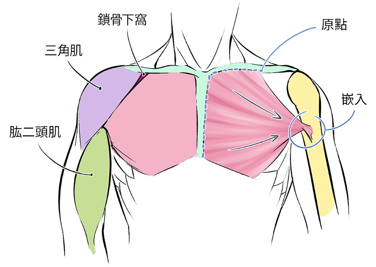
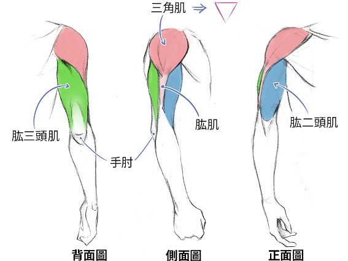
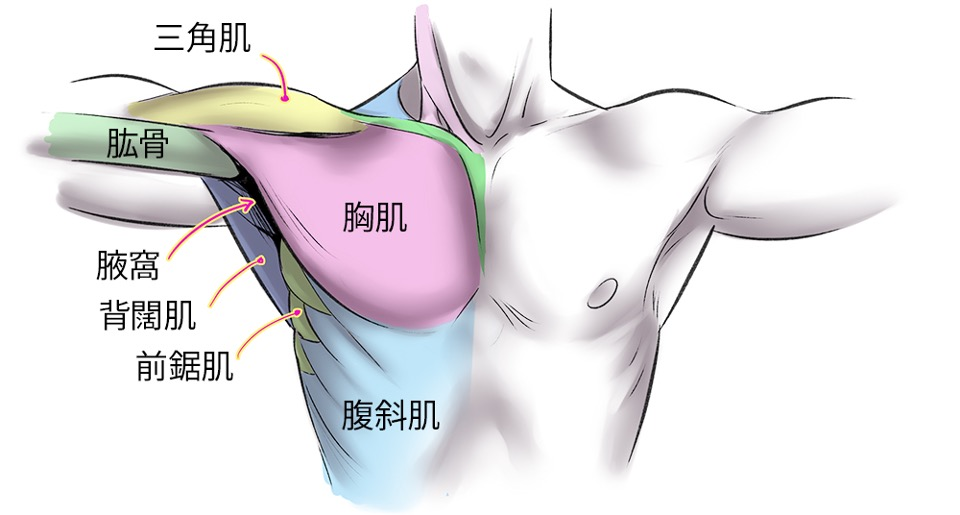
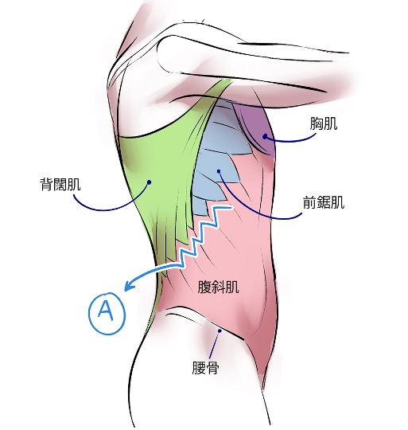
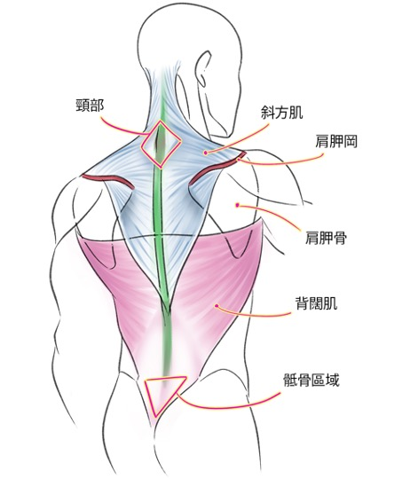
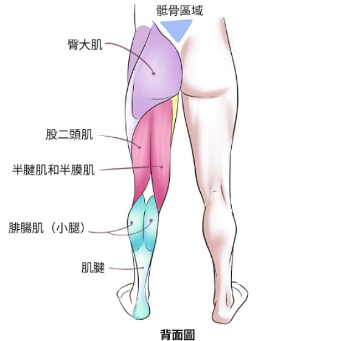

<h1 style="text-align: center"> 給爸爸的生日禮物</h1>
<h2>目錄</h2>

- [我們的目標](#我們的目標)
- [請熟記的健身原則](#請熟記的健身原則)
  - [疼痛](#疼痛)
  - [單關節運動](#單關節運動)
  - [輕重量 高組數](#輕重量-高組數)
  - [胸二胸一：肌肉平衡](#胸二胸一肌肉平衡)
- [第一階段 器械](#第一階段-器械)
- [第二階段 啞鈴](#第二階段-啞鈴)
- [第三階段 繩索](#第三階段-繩索)
- [人體肌肉指南與對應的伸展運動](#人體肌肉指南與對應的伸展運動)
  - [手臂](#手臂)
    - [正面圖](#正面圖)
    - [全面圖](#全面圖)
  - [胸部](#胸部)
  - [側腹](#側腹)
  - [背部](#背部)
  - [腿部](#腿部)
    - [正面圖](#正面圖-1)
    - [背面圖](#背面圖)

# 我們的目標
**爸爸健身的目標有三：**
- 穩固肌肉量 
- 燃燒卡路里
- 有週期性地加快心率

這個健身指南分為三個階段，難度由易到難，每個階段的適應期大約都在兩個月的時間。原則上在適應了一個階段的訓練後，就可以選擇性的加入下一個階段的動作。  

第二、三階段的動作其實針對的肌群與第一階段相似，但肌肉伸展的幅度較高(正因如此，更容易受傷)。加入第二、三階段的動作是為了增加肌肉鍛鍊的多樣性，減少某個機群過度訓練的可能性。  

 

# 請熟記的健身原則
## 疼痛
***注意！！！如果在訓練的過程中感到任何不適，請立即停止訓練並檢視自己的動作。***
 
運動期間在有腎上腺素的條件下還能感到疼痛，代表大不妙。關節處(特別是肩膀)如果有不自然的疼痛，真的很不妙。以我自己的經驗來說，關節類(包含軟骨和肌腱)的損傷，都需要休息三到四週才能恢復。

## 單關節運動
## 輕重量 高組數
## 胸二胸一：肌肉平衡

# 第一階段 器械
# 第二階段 啞鈴
# 第三階段 繩索

# 人體肌肉指南與對應的伸展運動
## 手臂
### 正面圖

### 全面圖

## 胸部

## 側腹

## 背部

## 腿部
### 正面圖

### 背面圖
