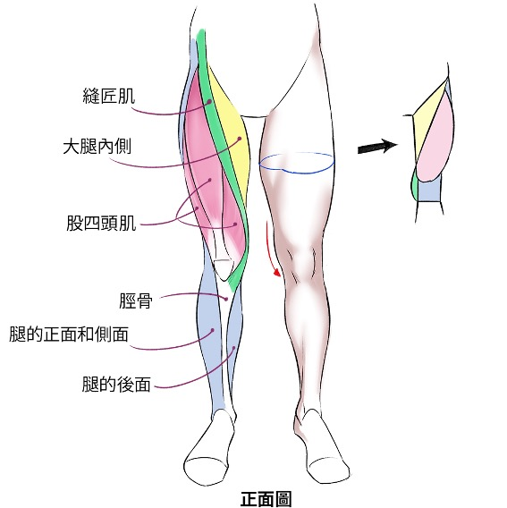

<h1 style="text-align: center"> 給爸爸的生日禮物</h1>
<h2>目錄</h2>

- [1. 我們的目標](#1-我們的目標)
- [2. 請熟記的健身原則](#2-請熟記的健身原則)
  - [2.1. 疼痛](#21-疼痛)
  - [2.2. 輕重量 高組數](#22-輕重量-高組數)
  - [2.3. 單關節運動](#23-單關節運動)
  - [2.4. 練胸、練肩、練背與練腿的原則](#24-練胸練肩練背與練腿的原則)
    - [2.4.1. 練肩](#241-練肩)
    - [2.4.2. 練胸](#242-練胸)
    - [2.4.3. 練背](#243-練背)
    - [2.4.4. 練腿](#244-練腿)
  - [2.5. 背二胸一：肌肉平衡](#25-背二胸一肌肉平衡)
- [3. 在健身後...放鬆筋膜＆拉伸肌肉](#3-在健身後放鬆筋膜拉伸肌肉)
  - [3.1. 放鬆筋膜](#31-放鬆筋膜)
  - [3.2. 拉伸肌肉: 每側約1-2分鐘](#32-拉伸肌肉-每側約1-2分鐘)
- [4. 第一階段 器械](#4-第一階段-器械)
  - [4.1. 推](#41-推)
  - [4.2. 拉](#42-拉)
  - [4.3. 腿](#43-腿)
- [5. 第二階段 自由重量 ＆ 繩索](#5-第二階段-自由重量--繩索)
  - [5.1. 推](#51-推)
  - [5.2. 拉](#52-拉)
  - [5.3. 腿](#53-腿)
- [6. 一些我看過，蠻有幫助的影片](#6-一些我看過蠻有幫助的影片)
- [7. 人體肌肉指南與對應的伸展運動](#7-人體肌肉指南與對應的伸展運動)
  - [7.1. 手臂](#71-手臂)
    - [7.1.1. 正面圖](#711-正面圖)
    - [7.1.2. 全面圖](#712-全面圖)
  - [7.2. 胸部](#72-胸部)
  - [7.3. 側腹](#73-側腹)
  - [7.4. 背部](#74-背部)
  - [7.5. 腿部](#75-腿部)
    - [7.5.1. 正面圖](#751-正面圖)
    - [7.5.2. 背面圖](#752-背面圖)

# 1. 我們的目標
**爸爸健身的目標有三：**
- 穩固肌肉量 
- 燃燒卡路里
- 有週期性地加快心率

這個健身指南分為三個階段，難度由易到難，每個階段的適應期大約都在兩個月的時間。原則上在適應了一個階段的訓練後，就可以選擇性的加入下一個階段的動作。  

第二、三階段的動作其實針對的肌群與第一階段相似，但肌肉伸展的幅度較高(正因如此，更容易受傷)。加入第二、三階段的動作是為了增加肌肉鍛鍊的多樣性，減少某個機群過度訓練的可能性。  

# 2. 請熟記的健身原則
## 2.1. 疼痛
***注意！！！如果在訓練的過程中感到任何不適，或碰到[關節彈響](https://www.youtube.com/watch?v=Y78gKVy6vOE)的狀況，請立即停止訓練並檢視自己的動作。***

運動期間在有腎上腺素的條件下還能感到疼痛，代表大不妙。關節處(特別是肩膀)如果有不自然的疼痛，真的很不妙。以我自己的經驗來說，關節類(包含軟骨和肌腱)的損傷，都需要休息三到四週才能恢復。

## 2.2. 輕重量 高組數
我們健身的目的是為了增加肌肉強度、韌性。因此，我們的訓練重量不需要很重，但是組數要多。高重量低組數的訓練方式會讓肌肉膨脹，但對增加肌肉量度幫助不大而且受傷風險非常高。

## 2.3. 單關節運動
在做單關節運動(比如說，側平舉、腿伸、腿曲等等)的時候要格外小心，並建議降低重量，增加組數。這是因為在運動時，收力支點都在同一個關節，非常容易受傷。

## 2.4. 練肩、練胸、練背與練腿的原則
### 2.4.1. 練肩
這個是健身最危險的部位，而且一旦受傷恢復的時間也最長的。如何避免[尖峰撞擊](https://youtu.be/PeYFGBz-i8M?si=QxdXbgNET82_aEYU)這個影片請好好看看。

### 2.4.2. 練胸
練胸部的時候請好好注意自己的肩膀，絕對不可以[聳肩](https://www.youtube.com/watch?v=mEO0HaPHZ6Q)，很容易受傷。訓練胸部肌群的時候請遵守抬頭挺胸，肩膀向後下沉的原則。

### 2.4.3. 練背
練背的時候請謹記[收好肩胛骨](https://www.youtube.com/watch?v=nDKJDSQnB_k)的原則。

### 2.4.4. 練腿
練腿個人認為相對簡單，原則上就分成大腿跟小腿兩個部分。大腿的訓練主要是深蹲，小腿的訓練主要是提踵。
- [練腿科普](https://www.youtube.com/watch?v=LjldfLkxfnI)
- [深蹲既瞟](https://www.youtube.com/watch?v=2J9zsFwhF2Q)

## 2.5. 背二胸一：肌肉平衡
我們健身除了燃脂塑型外，另一個目的是為了肌肉平衡。肌肉平衡是指身體各個部位的肌肉量相對平均，這樣可以減少受傷的機率。  
規劃健身的訓練量，做一天的胸部訓練，就要做兩天的背部訓練有幾個原因：
- 胸部肌肉的訓練會使肩膀內收，背部肌肉的訓練會使肩膀外展，因此多練背可以減少肩膀受傷的機率。
- 我和爸爸都會在辦公室長時間的工作，長久下來胸部肌群的強度會比背部肌群強([或是柔軟度比較低](https://youtu.be/BH78Z4TdJXg?si=MNK9emPAFsGsnVLb&t=72))，這樣會使肩膀內收，進而增加肩膀受傷的機率。胸部肌肉和背部肌肉是對立的肌肉，增加背部訓練可以使肌肉平衡。
- 一般來說，我們對胸部肌群的控制立會比較好(背部肌肉的組成比較複雜，沒有那麼好控制)，因此在健身初期胸部肌群會進步的比較快。胸部肌群增強的速度比背部肌群快會更進一步的使胸背肌肉失衡。

# 3. 在健身後...放鬆筋膜＆拉伸肌肉
參考影片：
- [學會使用泡沫軸](https://youtu.be/BH78Z4TdJXg?si=SR8QNsBMAATpK6xM)
- [系統熱身](https://youtu.be/ZfbeCRfBdwg?si=IhB5FWHHhoyQP7YD)
## 3.1. 放鬆筋膜
以下六個動作，放松大圆肌與放松髂经胫束一定要做。大圆肌緊繃會導致肩膀內收，
是肩痛的主因，而髂经胫束緊繃是膝蓋痛的主因。
1. [放松胸小肌](https://youtu.be/BH78Z4TdJXg?si=6Xm4pCC748ZFwRhZ&t=112)
2. [放松大圆肌（泡沫轴）](https://youtu.be/BH78Z4TdJXg?si=6Xm4pCC748ZFwRhZ&t=153)
3. [放松小腿三头肌（泡沫轴）](https://youtu.be/BH78Z4TdJXg?si=6Xm4pCC748ZFwRhZ&t=195)
4. [放松阔筋膜张肌（泡沫轴）](https://youtu.be/BH78Z4TdJXg?si=6Xm4pCC748ZFwRhZ&t=214)
6. [放松髂经胫束（泡沫轴）](https://youtu.be/BH78Z4TdJXg?si=6Xm4pCC748ZFwRhZ&t=252)

## 3.2. 拉伸肌肉: 每側約1-2分鐘
與放鬆筋膜的原則相似，一定要針對胸部肌肉做拉伸。一定要記得拉伸胸肌（胸大肌/胸小肌）。
1. [拉伸胸肌（胸大肌/胸小肌）](https://youtu.be/ZfbeCRfBdwg?si=DJXJX25XXUH-W062&t=143)
2. [拉伸背阔肌/大圆肌](https://youtu.be/BH78Z4TdJXg?si=ncdp0y1V0BATMcbR&t=376)
3. [拉伸小腿](https://youtu.be/BH78Z4TdJXg?si=ncdp0y1V0BATMcbR&t=396)
4. [拉伸髂腰肌和腰大肌](https://youtu.be/BH78Z4TdJXg?si=ncdp0y1V0BATMcbR&t=416)
5. [大腿后侧拉伸（弹力带）](https://youtu.be/BH78Z4TdJXg?si=ncdp0y1V0BATMcbR&t=445)

 

# 4. 第一階段 器械
第一階段，器械的使用可以約略分成三個部分，各約略一個小時(不包含熱身拉筋)：
- 推：胸部肌群、三頭肌、肩部肌群
- 拉：背部肌群、二頭肌
- 腿：腿部肌群

## 4.1. 推
每個動作3組，每組10-12次
*注意聳肩與關節彈響的問題！*
1. 胸推  
   
   
2. 肩推  
   *這個動作請格外小心，並注意聳肩與尖峰撞擊的問題。第一組建議用小重量熱身。*
   
   
3. 肘伸展
   
   

## 4.2. 拉
每個動作3組，每組10-12次
1. 高位下拉  
   *手腕跟小手臂在同一直線上。拉到底的時候收緊肩頰骨，不聳肩、不駝背*
   
   
2. 划船
   
   
3. 二頭彎舉  
   二頭彎舉可以直接使用啞鈴或是[小槓鈴](https://youtu.be/pY5SnT7oAdQ?si=IsXddHR6uYCObqsB&t=365)，反而不太建議使用器械。很多人用機器做二頭彎舉的時候直接把二頭肌扯斷，蠻危險的。

## 4.3. 腿
1. 腿伸：4-5組，每組15-20次  
   腿伸屬於前面所及的單關節運動。這個動作對膝蓋的負擔很大，原則上重量輕，組數多，做到股四頭肌痠軟。
   
2. 腿推：4組，每組10-12次  
   *這個動作對下背部的壓力很大，在座的時候不舒服的話請調整姿勢或是降低重量。*
   
   
3. [提踵](https://youtu.be/M5xbApTIYdc?si=k2XkE1eAawQV6euL)：4組，每組15-20次   
   提踵這個動作算是蠻直觀的。

# 5. 第二階段 自由重量 ＆ 繩索
## 5.1. 推
1. [胸推](https://youtu.be/i4QMbtnUx4A?si=-gLnDFLOxJomcmHG&t=197)：3組，每組10-12次
2. [上斜胸推](https://youtu.be/i4QMbtnUx4A?si=1QOjmSRUZ2Yc2FQN&t=357)：3組，每組10-12次
3. [肩推](https://youtu.be/Lt1AsayzFUc?si=0aIkJ1gN967Muij_&t=385)：3組，每組10-12次
4. [肘伸展](https://youtu.be/9gLmTRBa-bE?si=SQ9WX2i3faPCwP8N&t=75)：3組，每組10-12次
5. [側平舉](https://youtu.be/pY5SnT7oAdQ?si=GJig9Fn4yRIGmYWp&t=275)：4組，每組15-20次

## 5.2. 拉
1. [高位下拉](https://youtu.be/i4QMbtnUx4A?si=2_56OUnqkVTkjLOL&t=331)：3組，每組10-12次
   
   
2. [划船](https://youtu.be/i4QMbtnUx4A?si=x_5Vvi98lDTkf68U&t=401)：3組，每組10-12次
3. [面拉](https://youtu.be/pY5SnT7oAdQ?si=L5F9uvk2VJ6KUNrJ&t=334)：4組，每組15-20次

## 5.3. 腿
1.  [深蹲](https://youtu.be/pY5SnT7oAdQ?si=nY2LsRB_vjnRcaVx&t=109)：4組，每組8-10次

# 6. 一些我看過，蠻有幫助的影片
- [認識全身肌肉](https://www.youtube.com/watch?v=2_PvITQt4pg&list=PLi_zHK_mGGhbw5pfqL2RIXqY7BrwbHDzP&index=2)  
- [器械、啞鈴槓鈴、繩索的好處與壞處](https://www.youtube.com/watch?v=kD-J5KgdP_8&list=PLi_zHK_mGGhbw5pfqL2RIXqY7BrwbHDzP&index=3)
- [如果爸爸想自己規劃訓練菜單](https://www.youtube.com/watch?v=xePCiRs8Hfg&list=PLi_zHK_mGGhbw5pfqL2RIXqY7BrwbHDzP&index=5)
- [有效率的發力，針對目標肌群](https://www.youtube.com/watch?v=1vmiqq_LMPM&list=PLi_zHK_mGGhbw5pfqL2RIXqY7BrwbHDzP&index=6)

# 7. 人體肌肉指南

## 7.1. 手臂
### 7.1.1. 正面圖

### 7.1.2. 全面圖

## 7.2. 胸部

## 7.3. 側腹

## 7.4. 背部

## 7.5. 腿部
### 7.5.1. 正面圖

### 7.5.2. 背面圖

# 8. 爸脫爸脫